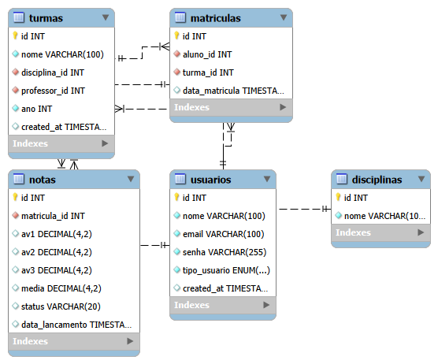

# 📚 Sistema Escolar

Sistema simples de gerenciamento escolar desenvolvido com Node.js, Express e MySQL. Permite que professores gerenciem turmas, alunos e notas, enquanto alunos podem visualizar suas notas e desempenho acadêmico.

## 🎯 Funcionalidades

### Para Professores
- ✅ Autenticação e controle de acesso
- ✅ Criação e gerenciamento de turmas
- ✅ Adicionar e remover alunos das turmas
- ✅ Lançamento de notas (AV1, AV2, AV3)
- ✅ Visualização automática de médias e status dos alunos

### Para Alunos
- ✅ Autenticação e controle de acesso
- ✅ Visualização de notas por disciplina
- ✅ Acompanhamento de média e status (Aprovado/Reprovado/Cursando)
- ✅ Dashboard intuitivo com todas as informações

### Sistema Geral
- ✅ Cadastro de novos usuários (alunos e professores)
- ✅ Autenticação JWT segura
- ✅ Cálculo automático de médias no banco de dados
- ✅ Interface responsiva e moderna

## 🛠️ Tecnologias Utilizadas

### Backend
- **Node.js** - Runtime JavaScript
- **Express.js** - Framework web
- **MySQL** - Banco de dados relacional
- **JWT** - Autenticação
- **dotenv** - Gerenciamento de variáveis de ambiente

### Frontend
- **HTML5** - Estrutura
- **CSS3** - Estilização
- **JavaScript (Vanilla)** - Lógica e interatividade
- **Fetch API** - Requisições HTTP

## 📋 Pré-requisitos

Antes de começar, você precisa ter instalado:

- [Node.js](https://nodejs.org/) (v14 ou superior)
- [MySQL](https://www.mysql.com/) (v8.0 ou superior)
- [Git](https://git-scm.com/)

## 🚀 Instalação

### 1. Clone o repositório

```bash
git clone https://github.com/seu-usuario/sistema-escolar.git
cd sistema-escolar
```

### 2. Configure o Backend

```bash
cd backend
npm install
```

### 3. Configure as variáveis de ambiente

Crie um arquivo `.env` na pasta `backend`:

```env
PORT=3001

DB_HOST=localhost
DB_USER=root
DB_PASSWORD=sua_senha
DB_NAME=sistema_escolar

JWT_SECRET=seu_secret_aqui
```

### 4. Configure o Banco de Dados

Execute o script SQL para criar o banco e as tabelas:

```bash
mysql -u root -p < backend/database/schema.sql
```

Ou importe manualmente o arquivo `schema.sql` no MySQL Workbench.

### 5. Inicie o servidor

```bash
cd backend
npm start
```

O servidor iniciará em `http://localhost:3001`

### 6. Abra o Frontend

Abra o arquivo `index.html` no navegador ou use um servidor local:

```bash
# Com Live Server (VS Code)
# Ou com http-server
npx http-server frontend -p 8080
```

## 📁 Estrutura do Projeto

```
sistema-escolar/
├── backend/
│   ├── controllers/
│   │   ├── authController.js
│   │   ├── userController.js
│   │   ├── turmaController.js
│   │   ├── disciplinaController.js
│   │   ├── matriculaController.js
│   │   └── notaController.js
│   ├── routes/
│   │   ├── authRoutes.js
│   │   ├── userRoutes.js
│   │   ├── turmaRoutes.js
│   │   ├── disciplinaRoutes.js
│   │   ├── matriculaRoutes.js
│   │   └── notaRoutes.js
│   ├── middlewares/
│   │   └── authMiddleware.js
│   ├── database/
│   │   ├── connection.js
│   │   └── schema.sql
│   ├── .env
│   ├── server.js
│   └── package.json
├── frontend/
│   ├── css/
│   │   ├── style.css
│   │   └── dashboard.css
│   ├── js/
│   │   ├── api.js
│   │   ├── login.js
│   │   ├── cadastro.js
│   │   ├── dashboard-aluno.js
│   │   ├── dashboard-professor.js
│   │   ├── gerenciar-alunos.js
│   │   └── lancar-notas.js
│   ├── index.html
│   ├── cadastro.html
│   ├── dashboard-aluno.html
│   ├── dashboard-professor.html
│   ├── gerenciar-alunos.html
│   └── lancar-notas.html
└── README.md
```

## 🗄️ Modelo do Banco de Dados

### Tabelas Principais

- **usuarios** - Armazena alunos e professores
- **disciplinas** - Matérias disponíveis
- **turmas** - Turmas criadas pelos professores
- **matriculas** - Relacionamento entre alunos e turmas
- **notas** - Notas dos alunos (com cálculo automático de média)

### Diagrama EER



## 🔑 Usuários de Teste

Após executar o `schema.sql`, você terá acesso aos seguintes usuários:

### Professor
- **Email:** joao@escola.com
- **Senha:** 123456

### Alunos
- **Email:** pedro@escola.com | **Senha:** 123456
- **Email:** ana@escola.com | **Senha:** 123456
- **Email:** carlos@escola.com | **Senha:** 123456

## 🌐 API Endpoints

### Autenticação
```
POST   /api/auth/login              - Login de usuário
```

### Usuários
```
GET    /api/usuarios                - Listar usuários
POST   /api/usuarios                - Cadastrar usuário
GET    /api/usuarios/:id            - Buscar usuário
PUT    /api/usuarios/:id            - Atualizar usuário
DELETE /api/usuarios/:id            - Deletar usuário
```

### Turmas
```
GET    /api/turmas                  - Listar todas as turmas
GET    /api/turmas/professor/:id    - Listar turmas do professor
POST   /api/turmas                  - Criar turma
```

### Matrículas
```
POST   /api/matriculas              - Matricular aluno
GET    /api/matriculas/turma/:id    - Listar alunos da turma
DELETE /api/matriculas/turma/:turmaId/aluno/:alunoId - Remover aluno
```

### Notas
```
POST   /api/notas                   - Lançar/atualizar notas
GET    /api/notas/aluno/:id         - Buscar notas do aluno
GET    /api/notas/turma/:turmaId/aluno/:alunoId - Buscar nota específica
```

### Disciplinas
```
GET    /api/disciplinas             - Listar disciplinas
POST   /api/disciplinas             - Criar disciplina
```

## 🎨 Screenshots

| 🔐 Login | 👨‍🎓 Dashboard Aluno |
|--------|---------------------|
|  |  |

| 👨‍🏫 Dashboard Professor | 👥 Gerenciar Alunos |
|-------------------------|--------------------|
|  |  |

| 📝 Lançar Notas |
|----------------|
|  |

## 🤝 Contribuindo

Contribuições são sempre bem-vindas! Para contribuir:

1. Faça um Fork do projeto
2. Crie uma branch para sua feature (`git checkout -b feature/MinhaFeature`)
3. Commit suas mudanças (`git commit -m 'Adiciona MinhaFeature'`)
4. Push para a branch (`git push origin feature/MinhaFeature`)
5. Abra um Pull Request

## 📝 Melhorias Futuras

- [ ] Implementar criptografia de senhas (bcrypt)
- [ ] Adicionar sistema de recuperação de senha
- [ ] Criar relatórios em PDF
- [ ] Implementar chat entre professor e aluno
- [ ] Adicionar sistema de presença/frequência
- [ ] Criar dashboard administrativo
- [ ] Implementar notificações por email
- [ ] Adicionar suporte a múltiplos idiomas
- [ ] Criar aplicativo mobile

## 📄 Licença

Este projeto está sob a licença MIT. Veja o arquivo [LICENSE](LICENSE) para mais detalhes.

## 🙏 Considerações

- Inspirado em sistema simples de gestão escolar
- Desenvolvido como projeto de aprendizado
- Integração entre front-end e back-end

---

⭐ Se este projeto te ajudou, considere dar uma estrela!

**Desenvolvido com ❤️ por Laryssa Leal**
